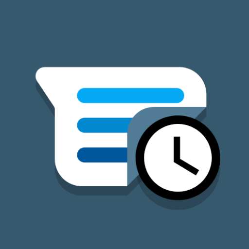
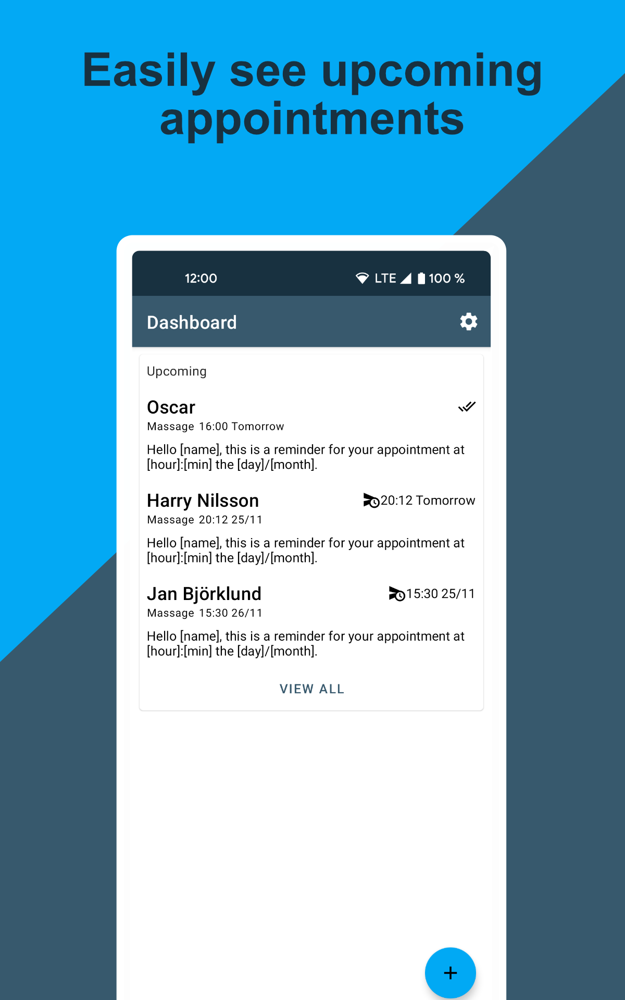
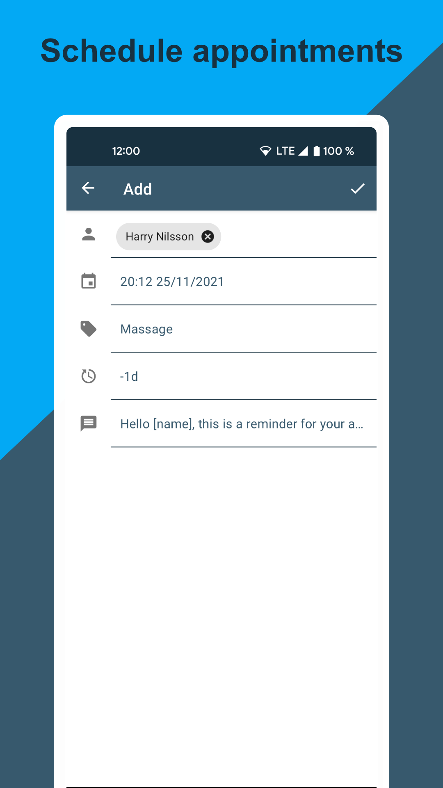
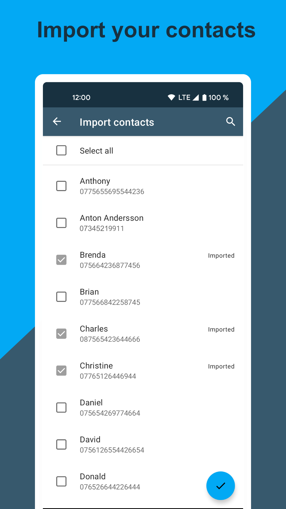
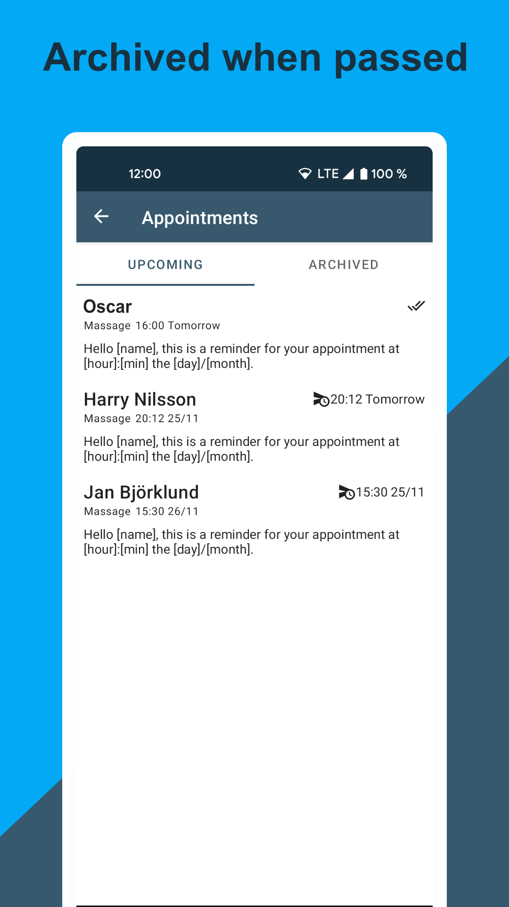
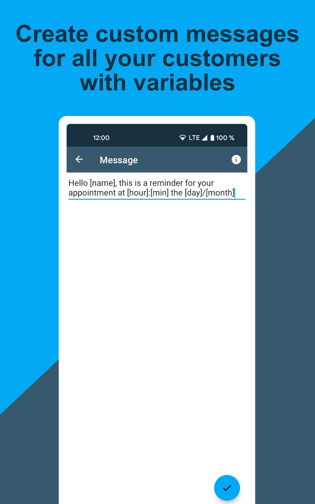
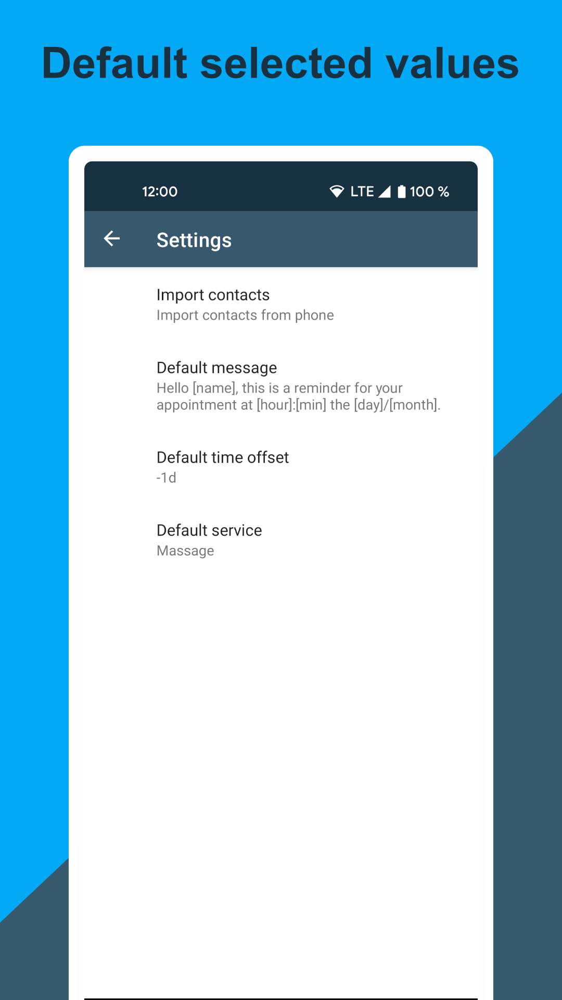

# Pigeon
</img>

Pigeon can schedule SMS reminders for appointments.

### Automatic updates from template

If you need to change your SMS message template all appointments which is not yet sent will be updated and the new text will be sent.

### Variables

Variables are words in the message template which will be replace with data and make you SMS custom for each customer and appointment.

#### Possible variables

variable name | explanation
--|--
[name] | the name of the customer which have booked the treatment
[min] | the minute which the customer should arrive
[hour] | the hour which the customer should arrive. currently only supports 24h format
[day] | the day of the month which the customer should arrive
[month] | the month of the year which the customer should arrive
[year] | the year which the customer should arrive. Currently only a 4 digit number, e.g 2021
[service] | the service selected

### Notifications

If an SMS fails to be sent you will receive a notification. There is also in app notifications which help you solve the problems faster and easier by giving you actions based on the error.

### Screenshots
</img>
</img>
</img>
</img>
</img>
</img>
